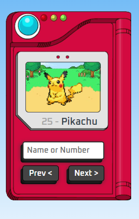

# ALGA SHOPPING

Aplicação web que simula uma pokedex da franquia de Pokemon.

 
Link: https://pokedex-raphael-lima.netlify.app/

## Minha aplicação:

## Tecnologias utilizadas:

<ul>

  <li>JavaScript</li>

  <li>HTML</li>

  <li>CSS</li>

</ul>

## Sobre a aplicação:

Essa aplicação simula um pokedex usado nos jogos e desenhos de Pokemon, para a realização do projeto apenas consumi uma API e apesentei seus dados, é possível pesquisar um pokemon pelo nome, código ou usando as teclas de avançar e retroceder.

## Ficaria feliz com Feedbacks:

Email: raphaeldesousalm@gmail.com  

Linkdin: https://www.linkedin.com/in/raphaellima98/
